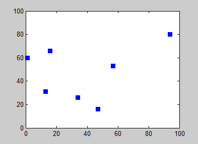
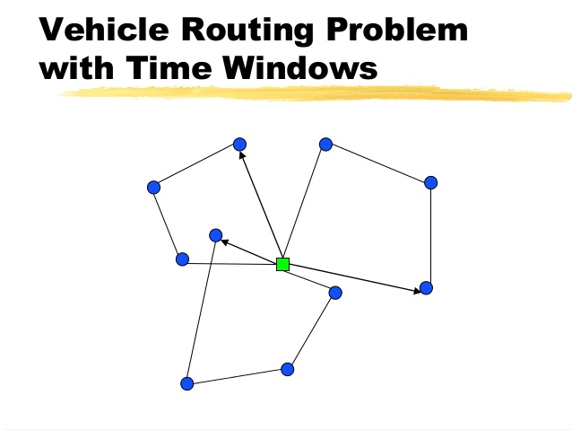

# A-Case-Study-for-Large-Scale-Vehicle-Routing
Vehicle routing problem (VRP) is a generic name referring to optimization problems in transportation, distribution and logistics industry. . Route planning techniques is one of the main tasks of VRP which aims to find an optimal route from a starting point to a destination on a road map. Choosing an appropriate route planning algorithm among the existing algorithms in the literature to apply it in real road networks is an important task for any transportation application. In this project, we first present two of the different route planning algorithms, and then explain how we compare and analyze their performance when they are applied in real road networks.

#

#

